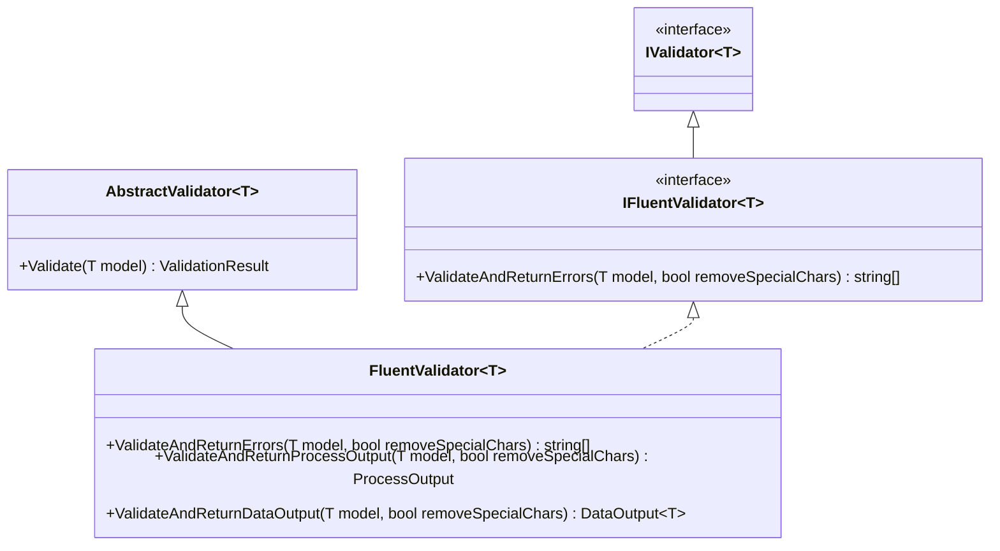

# ArturRios.Validation

[](https://artur-rios.github.io/dotnet-validation)
[](./LICENSE)
[](https://www.nuget.org/packages/ArturRios.Validation)

**`ArturRios.Validation`** — a thin, opinionated model-validation layer for .NET built on top of
[FluentValidation](https://docs.fluentvalidation.net/). It wraps FluentValidation's `AbstractValidator<T>`
in a `FluentValidator<T>` base class that turns validation results into the shapes an application actually
consumes: a plain array of error messages, or an [`ArturRios.Output`](https://www.nuget.org/packages/ArturRios.Output)
`ProcessOutput` / `DataOutput<T>` envelope — with optional stripping of the quotes and periods that
FluentValidation puts in its default messages.

- 📚 **Full documentation:** <https://artur-rios.github.io/dotnet-validation>

## What you get

| Type | What it does |
|---|---|
| `FluentValidator<T>` | Base validator: subclass it, declare `RuleFor(...)` rules in the constructor, get error/`Output` helpers for free. |
| `IFluentValidator<T>` | Abstraction over `FluentValidator<T>` (extends FluentValidation's `IValidator<T>`) for DI and testing. |



## Installation

```bash
dotnet add package ArturRios.Validation
```

Targets **.NET 10**. It pulls in `FluentValidation` and `ArturRios.Output` transitively.

## Quick start

1. Define a model and a validator, declaring rules exactly as you would with FluentValidation:

```csharp
using ArturRios.Validation;
using FluentValidation;

public class Person
{
    public string Name { get; set; } = string.Empty;
    public int Age { get; set; }
}

public class PersonValidator : FluentValidator<Person>
{
    public PersonValidator()
    {
        RuleFor(p => p.Name).NotEmpty();
        RuleFor(p => p.Age).GreaterThan(0);
    }
}
```

2. Validate and consume the result in whichever shape you need:

```csharp
var validator = new PersonValidator();
var person = new Person { Name = "", Age = 0 };

// a) Just the error messages
string[] errors = validator.ValidateAndReturnErrors(person);
// => [ "'Name' must not be empty.", "'Age' must be greater than '0'." ]

// b) Same, but strip the quotes and periods FluentValidation adds
string[] clean = validator.ValidateAndReturnErrors(person, removeSpecialChars: true);
// => [ "Name must not be empty", "Age must be greater than 0" ]

// c) A ProcessOutput envelope (Success is false when there are errors)
ProcessOutput result = validator.ValidateAndReturnProcessOutput(person);

// d) A DataOutput<T> envelope that also carries the validated model back
DataOutput<Person> dataResult = validator.ValidateAndReturnDataOutput(person);
```

Every helper accepts the optional `removeSpecialChars` flag, which removes `'` and `.` from the messages.

## Documentation

| Page | What's there |
|---|---|
| [Overview](https://artur-rios.github.io/dotnet-validation/) | Concepts, the full API surface, and end-to-end examples. |

## Versioning

Semantic Versioning (SemVer). Breaking changes bump the major version; new non-breaking behavior bumps
the minor; fixes bump the patch.

## Build, test and publish

Use the official [.NET CLI](https://learn.microsoft.com/en-us/dotnet/core/tools/) to build, test and
publish, and Git for source control. Optional helper toolsets:
[Dotnet Tools](https://github.com/artur-rios/dotnet-tools) ·
[Python Dotnet Tools](https://github.com/artur-rios/python-dotnet-tools).

## Legal

Licensed under the [MIT License](https://en.wikipedia.org/wiki/MIT_License) — see [LICENSE](./LICENSE).
