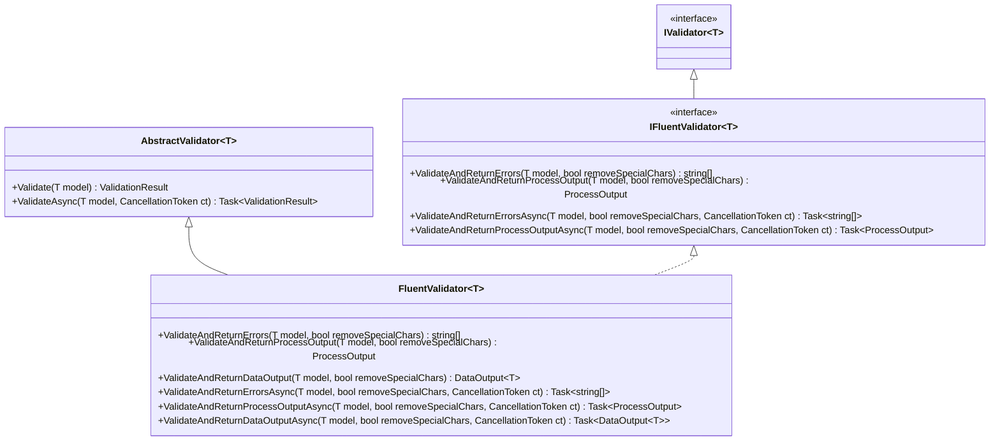

A thin, opinionated model-validation layer for .NET built on top of
[FluentValidation](https://docs.fluentvalidation.net/). It wraps FluentValidation's
`AbstractValidator<T>` in a `FluentValidator<T>` base class that turns validation results into the shapes
an application actually consumes: a plain array of error messages, or an
[`ArturRios.Output`](https://www.nuget.org/packages/ArturRios.Output) `ProcessOutput` / `DataOutput<T>`
envelope — with optional stripping of the quotes and periods FluentValidation puts in its default
messages.

## The API surface

| Type | What it does |
|---|---|
| `FluentValidator<T>` | Base validator: subclass it, declare `RuleFor(...)` rules in the constructor, get error/`Output` helpers for free. |
| `IFluentValidator<T>` | Abstraction over `FluentValidator<T>` (extends FluentValidation's `IValidator<T>`) for DI and testing. |

Every helper has an asynchronous counterpart taking a `CancellationToken`. Reach for those whenever the
validator declares an asynchronous rule — `MustAsync`, `CustomAsync` and the like — because
FluentValidation refuses to run one from a synchronous call and throws
`AsyncValidatorInvokedSynchronouslyException` instead.

`IFluentValidator<T>` is contravariant in `T`, so a validator for a base type can stand in for one of a
derived type. That is also why `ValidateAndReturnDataOutput` is not on the interface: it returns a
`DataOutput<T>`, which puts `T` in an output position, and contravariance forbids that. Take the concrete
`FluentValidator<T>` when the validated model has to come back inside the envelope.



`FluentValidator<T>` exposes three helpers, each accepting an optional `removeSpecialChars` flag:

| Method | Returns | Use when |
|---|---|---|
| `ValidateAndReturnErrors(model, removeSpecialChars)` | `string[]` | You only need the raw error messages (empty array when valid). |
| `ValidateAndReturnProcessOutput(model, removeSpecialChars)` | `ProcessOutput` | You want a success/error envelope, without a payload. |
| `ValidateAndReturnDataOutput(model, removeSpecialChars)` | `DataOutput<T>` | You want the envelope **and** the validated model carried back. |
| `ValidateAndReturnErrorsAsync(model, removeSpecialChars, ct)` | `Task<string[]>` | Same, for a validator with asynchronous rules. |
| `ValidateAndReturnProcessOutputAsync(model, removeSpecialChars, ct)` | `Task<ProcessOutput>` | Same, for a validator with asynchronous rules. |
| `ValidateAndReturnDataOutputAsync(model, removeSpecialChars, ct)` | `Task<DataOutput<T>>` | Same, for a validator with asynchronous rules. |

When `removeSpecialChars` is `true`, the characters `'` and `.` are removed from every message — handy
when FluentValidation's default `"'Name' must not be empty."` clashes with your presentation layer.

## Installation

```bash
dotnet add package ArturRios.Validation
```

Targets **.NET 10**. It pulls in `FluentValidation` and `ArturRios.Output` transitively.

## Quick start

Define a model and a validator, declaring rules exactly as you would with FluentValidation:

```csharp
using ArturRios.Validation;
using FluentValidation;

public class Person
{
    public string Name { get; set; } = string.Empty;
    public int Age { get; set; }
}

public class PersonValidator : FluentValidator<Person>
{
    public PersonValidator()
    {
        RuleFor(p => p.Name).NotEmpty();
        RuleFor(p => p.Age).GreaterThan(0);
    }
}
```

Then validate and consume the result in whichever shape you need:

```csharp
var validator = new PersonValidator();
var person = new Person { Name = "", Age = 0 };

// a) Just the error messages
string[] errors = validator.ValidateAndReturnErrors(person);
// => [ "'Name' must not be empty.", "'Age' must be greater than '0'." ]

// b) Same, but strip the quotes and periods FluentValidation adds
string[] clean = validator.ValidateAndReturnErrors(person, removeSpecialChars: true);
// => [ "Name must not be empty", "Age must be greater than 0" ]

// c) A ProcessOutput envelope (Success is false when there are errors)
ProcessOutput result = validator.ValidateAndReturnProcessOutput(person);

// d) A DataOutput<T> envelope that also carries the validated model back
DataOutput<Person> dataResult = validator.ValidateAndReturnDataOutput(person);
```

## Working with the Output envelopes

Both `ProcessOutput` and `DataOutput<T>` come from
[`ArturRios.Output`](https://www.nuget.org/packages/ArturRios.Output):

- `Success` is `true` when there are no errors, `false` otherwise.
- `Errors` holds the validation messages (already run through `removeSpecialChars` if requested).
- `DataOutput<T>.Data` carries the model you passed in — it is populated regardless of whether validation
  succeeded, so you can inspect the offending values alongside the errors.

```csharp
var output = validator.ValidateAndReturnDataOutput(person, removeSpecialChars: true);

if (!output.Success)
{
    foreach (var error in output.Errors)
    {
        Console.WriteLine(error);
    }
}

Person? echoed = output.Data; // the same instance you validated
```

## Dependency injection

Because `FluentValidator<T>` implements `IFluentValidator<T>` (which extends FluentValidation's
`IValidator<T>`), you can register and inject validators against the abstraction:

```csharp
services.AddScoped<IFluentValidator<Person>, PersonValidator>();
```

## Testing

The test suite is xUnit, and every test is named with the Given / When / Then pattern. Every test class
carries a `Category` trait, so the two kinds can be run — and reported — separately:

```bash
dotnet test src/ArturRios.Validation.sln --filter "Category=Unit"
dotnet test src/ArturRios.Validation.sln --filter "Category=Functional"
```

Unit tests exercise the code in isolation against test doubles.
Functional tests resolve the validator out of a real service collection, behind both contracts, and drive
whole request-shaped flows through it.
CI runs the two as separate jobs, and both must pass before a pull request can be merged.
